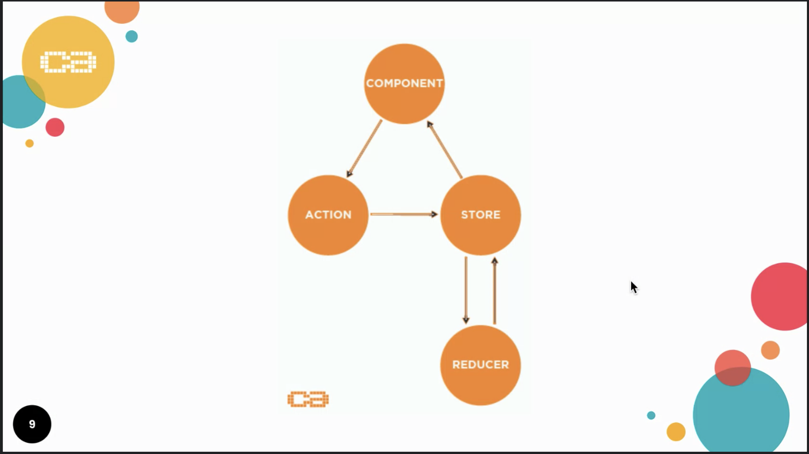
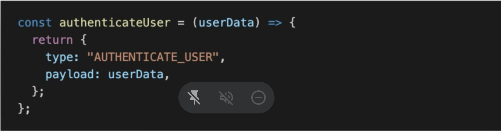
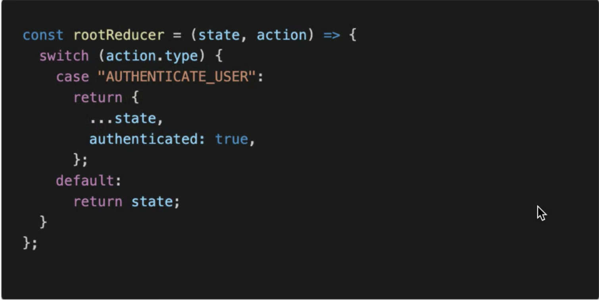
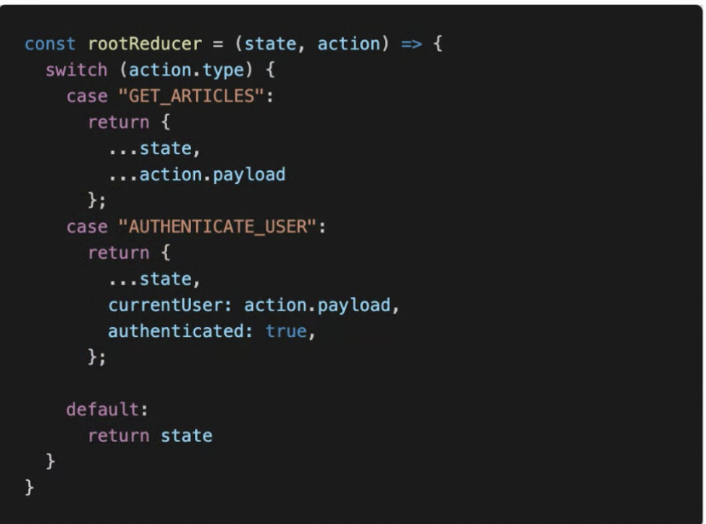

# Redux Demo

Installed Redux and initialized the folders and files to be able to subscribe and modify states.

## Conclusion

Really handy if for example we are going to modify the user's order in Slow Food App and much more.

## Redux Background

Redux provides a solid, stable and mature solution to managing state in your React application.

Through a handful of small, useful patterns Redux can transform your application from a total mess of confusing and scattered state and props hell, into a delightfully organized, and easy to understand JavaScript application.

Redux maintains the state of an entire application in a single immutable state tree (object), which can't be changed directly. When something changes, a new object is created.

## Benefits

- Server rendering

- Developer tools

- Ease of testing

- Community and ecosystem

## Building Blocks

To understand the concepts behind Redux, we first need to take a look at the main building blocks.

Redux involes three parts: Actions, Reducers and Store.



### Action creators

Action Objects can be created by using functions (This is opional). These functions are called action creators:



You can see that the only purpose of an action creatore function is to return the action object.

### Reducers

Reducers are the most important building block and it's important to understand the concept.

Reducers are pure JavaScript functions that take the current application state and an action object and return a new application state.



The important thing to notice here is that the state is not changed directly. Instead, a new state object (based on the old state) is created and the update is done to the new state.



## Redux Work Flow

```
yarn add redux react-redux in command line.

mkdir src/state

mkdir state/reducers

mkdir state/store

touch src/state/reducers/rootReducer.js

touch src/state/store/configureStore.js

touch src/state/store/initialState.js
```

## Configure

### initialState.js

```
const initialState = {
  greeting: "Hello World from Application State",
};

export default initialState;
```

### rootReducer

```
import initialState from "../store/initialState";

const rootReducer = (state = initialState, action) => {
  if (action.type === "CHANGE_GREETING") {
    return { ...state, greeting: action.payload };
  } else {
    return state;
  }
};

export default rootReducer;
```

### configureStore

```
import { createStore } from "redux";
import rootReducer from "../reducers/rootReducer";

const configureStore = () => {
  return createStore(rootReducer);
};

export default configureStore;
```

### index.js

```
import React from "react";
import ReactDOM from "react-dom";
import App from "./App";
import { Provider } from "react-redux";
import configureStore from "./state/store/configureStore";

const store = configureStore();
// just a hack to test this in console
window.store = store;

ReactDOM.render(
  <React.StrictMode>
    <Provider store={store}>
      <App />
    </Provider>
  </React.StrictMode>,
  document.getElementById("root")
);
```

### app.jsx

```
import React, { useState } from "react";
import { useSelector, useDispatch } from "react-redux";

const App = () => {
  const dispatch = useDispatch();
  const { greeting } = useSelector((state) => state);
  const [newGreeting, setNewGreeting] = useState();
  const dispatchGreeting = () => {
    dispatch({
      type: "CHANGE_GREETING",
      payload: newGreeting,
    });
  };

  return (
    <div>
      <h1>{greeting}</h1>
      <input
        type="text"
        placeholder="Type your Greeting"
        onChange={(event) => setNewGreeting(event.target.value)}
      />
      <button onClick={() => dispatchGreeting()}>Click Me</button>
    </div>
  );
};

export default App;
```
